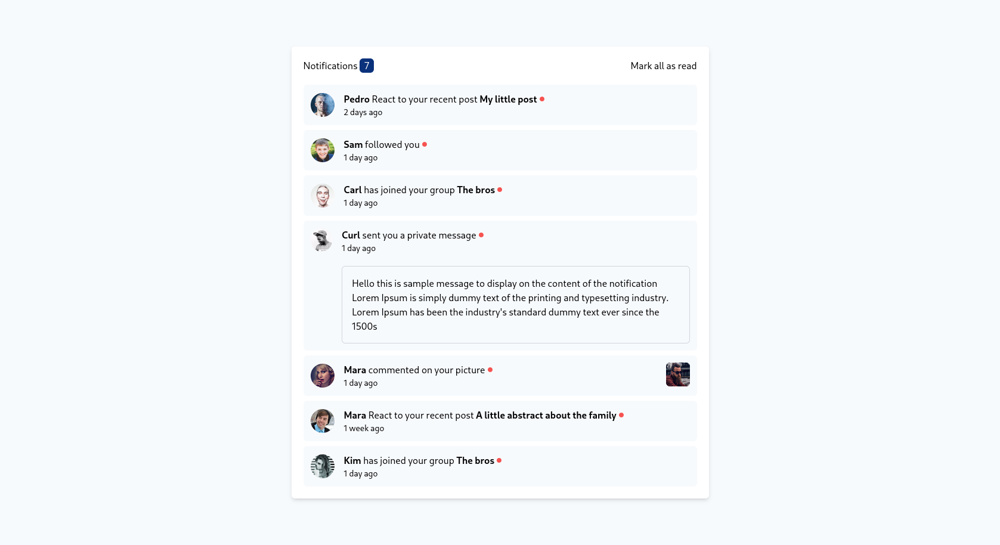

# Frontend Mentor - Social links profile solution

This is a solution to the [Notifications page challenge on Frontend Mentor](https://www.frontendmentor.io/challenges/notifications-page-DqK5QAmKbC)

## Table of contents

- [Overview](#overview)
  - [The challenge](#the-challenge)
  - [Screenshot](#screenshot)
  - [Links](#links)
- [My process](#my-process)
  - [Built with](#built-with)
- [Author](#author)

## Overview

### The challenge

Users should be able to:

- Distinguish between "unread" and "read" notifications
- Select "Mark all as read" to toggle the visual state of the unread notifications and set the number of unread messages to zero
- View the optimal layout for the interface depending on their device's screen size
- See hover and focus states for all interactive elements on the page

### Screenshot

### Links

- Solution URL: [Social links page](https://g-uriarte.github.io/fm-notifications-page/)
- Live Site URL: [live site](https://g-uriarte.github.io/fm-notifications-page/)

## My process

### Built with

- Semantic HTML5 markup
- CSS flexbox
- Mobile-first workflow
- [React](https://reactjs.org/) - JS library
- [Taildwindcss](https://tailwindcss.com/) - For styles

## Author

- Frontend Mentor - [@g-uriarte](https://www.frontendmentor.io/profile/g-uriarte)